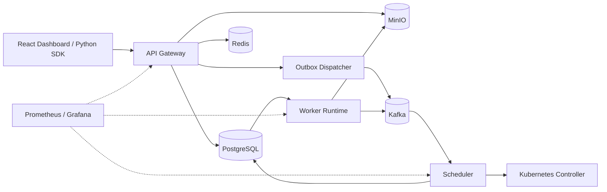

<div align="center">
  <h1>Mini Databricks</h1>
  <p><strong>A distributed analytics platform for submitting Python jobs, orchestrating execution, and serving artifacts through a full-stack control plane.</strong></p>
  <p>Go • PostgreSQL • Kafka • Redis • MinIO • Kubernetes • React • Prometheus • OpenTelemetry</p>
  <p>
    
    
    
    
    
  </p>
</div>

---

## Overview

Mini Databricks is a production-style distributed systems project that accepts dataset uploads, schedules partitioned compute jobs, executes Python workloads across workers, and returns artifacts through a REST API, Python SDK, and React dashboard.

The goal of the project is not notebook UX. It is the platform layer behind data products: orchestration, reliability, storage, scheduling, observability, and multi-service coordination.

## What This Project Demonstrates

- Event-driven backend design with Go services, Kafka, PostgreSQL, Redis, and MinIO
- Distributed job execution with task sharding, leasing, heartbeats, timeouts, and cleanup
- Reliability patterns such as transactional outbox publishing, idempotent job submission, and dead-letter handling
- Full-stack delivery across API design, infrastructure, Python SDK development, and frontend implementation
- Operational maturity through metrics, health endpoints, admin stats, and trace propagation

## Architecture



## Execution Flow

1. A client registers a dataset and uploads it directly to MinIO using a signed URL.
2. A job submission is persisted to PostgreSQL and mirrored into an outbox record in the same transaction.
3. The dispatcher publishes the job event to Kafka.
4. The scheduler creates a run, shards the workload into tasks, and prepares execution.
5. Workers lease tasks, execute Python code on partitions, upload artifacts, and update progress.
6. The API, SDK, and dashboard expose status, progress, and downloadable results.

## Engineering Highlights

| Concern | Implementation |
| --- | --- |
| Reliable event publishing | Transactional outbox between API writes and Kafka publication |
| Safe retries | Idempotency keys on job creation |
| Concurrent task claims | Postgres task leasing with `FOR UPDATE SKIP LOCKED` |
| Failure handling | Worker heartbeats, task timeouts, dead tasks, cleanup jobs, dead-letter topic |
| Storage pipeline | Signed MinIO upload and download URLs with artifact registration |
| Operational visibility | Prometheus metrics, `/health`, `/ready`, `/admin/stats`, OpenTelemetry trace propagation |
| Platform isolation hooks | Workspace-scoped auth plus Kubernetes namespace, quota, and network-policy hooks |

## Core Services

| Service | Responsibility |
| --- | --- |
| API Gateway | Authentication, workspace APIs, dataset registration, job submission, progress, artifact access |
| Scheduler | Consumes job events, creates runs and tasks, coordinates execution |
| Worker | Leases tasks, runs Python workloads, writes artifacts, reports status |
| Autoscaler | Adjusts worker replicas based on queue depth |
| Cleanup | Removes dead tasks and delivered outbox records |
| Frontend | React dashboard for job visibility and interaction |
| Python SDK | Developer-facing client for submitting and monitoring jobs |

## Tech Stack

| Layer | Technologies |
| --- | --- |
| Backend | Go, Gin, pgx, sqlc |
| Data & Messaging | PostgreSQL, Kafka, Redis, MinIO |
| Execution | Python 3.11, Pandas, PyArrow |
| Frontend | React 19, TypeScript, Vite |
| Infrastructure | Docker Compose, Kubernetes, Kind |
| Observability | Prometheus, Grafana, OpenTelemetry |

## Local Development

### Prerequisites

- Docker
- Go 1.25
- Node.js with `pnpm`
- Python 3.11 with Poetry
- `golang-migrate`

### 1. Configure environment

Update the root `.env` file with your local database, Redis, Kafka, MinIO, JWT, and Python runner settings.

### 2. Start infrastructure

```bash
make docker-up
make migrate-up
```

This provisions PostgreSQL, Redis, Kafka, MinIO, Prometheus, and Grafana.

### 3. Run backend services

Start each service in a separate terminal:

```bash
go run ./services/api-gateway/cmd/
go run ./services/scheduler/cmd/
go run ./services/worker/cmd/
go run ./services/autoscaler/cmd/
go run ./services/cleanup/cmd/
```

### 4. Run basic checks

```bash
make lint
make test
```

### 5. Run a quick API smoke test

With the API Gateway and supporting services running, use the built-in Make targets to validate auth and workspace flows:

```bash
make smoke-api
```

This runs:

```bash
make register
make login
make me
make create-workspace
make list-workspaces
```

If the default test account already exists, rerun with a different email:

```bash
make smoke-api TEST_EMAIL=another-user@test.com
```

There are also parameterized helpers for dataset and job endpoints:

```bash
make initiate-dataset WORKSPACE_ID=<workspace-id>
make list-datasets WORKSPACE_ID=<workspace-id>
make create-job WORKSPACE_ID=<workspace-id> DATASET_ID=<dataset-id>
make list-jobs WORKSPACE_ID=<workspace-id>
```

### 6. Start the frontend

```bash
cd frontend
pnpm install
pnpm dev
```

### 7. Try the SDK

```bash
cd sdk/python
poetry install
poetry run python example.py
```

## Developer Surfaces

| Surface | URL / Path |
| --- | --- |
| API | `http://localhost:8080/api/v1` |
| Frontend | `http://localhost:5173` |
| Prometheus | `http://localhost:9090` |
| Grafana | `http://localhost:3001` |
| MinIO Console | `http://localhost:9001` |
| API Reference | [`docs/api.md`](docs/api.md) |
| Python Example | [`sdk/python/example.py`](sdk/python/example.py) |

## Repository Layout

```text
services/
  api-gateway/   REST API, auth, dataset and job endpoints
  scheduler/     Kafka consumer and run/task creation
  worker/        Task leasing and Python execution runtime
  autoscaler/    Worker replica scaling logic
  cleanup/       Background maintenance jobs

internal/
  db/            Migrations, SQL queries, generated models
  kafka/         Producer, consumer, outbox dispatcher
  k8s/           Kubernetes orchestration and isolation hooks
  storage/       MinIO integration
  telemetry/     OpenTelemetry setup

frontend/        React dashboard
sdk/python/      Python client SDK and example jobs
deployments/     Docker and Kubernetes manifests
docs/            API documentation
```

## Deployment Path

The repository includes Dockerfiles, Docker Compose infrastructure, Kind bootstrap scripts, and Kubernetes manifests for services, secrets, migrations, and ingress. For cluster-based experimentation, use:

```bash
make kind-setup
```

## Why This Is a Strong Systems Project

Mini Databricks shows the kind of engineering depth recruiters look for in backend and platform candidates: asynchronous workflows, distributed task execution, storage pipelines, operational visibility, and infrastructure-aware design shipped as a cohesive product rather than isolated demos.
